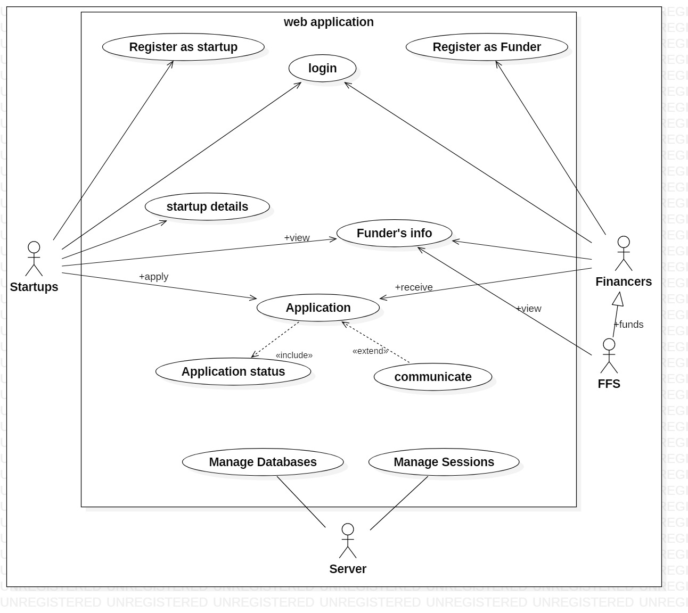

 <dl>
 		<dt>Financing platform for startups </dt>
 	</dl>

---------------------------------------------------------------------------------------------------------------------

There are no online financing platform for startups to get funded.
We have built an online financing platform <i><b>"PRARAMBH"</b>></i> which aggregates all the investment vehicles for startups.

---------------------------------------------------------------------------------------------------------------------

## Features
* Both startups and funders can register.
* Verification through email.
* Startups can apply for multiple funders.
* Early prediction for startups to get funded.
* Documents are secured through <b>BLOCK-CHAIN</b> mechanism.
* Funders can filtrate the applications (startups) 
* Users can see the status of approval for their startups.

---------------------------------------------------------------------------------------------------------------------
## Installations
* Refer requirements.txt

---------------------------------------------------------------------------------------------------------------------
## UML DIAGRAM

---------------------------------------------------------------------------------------------------------------------
## Screenshots

